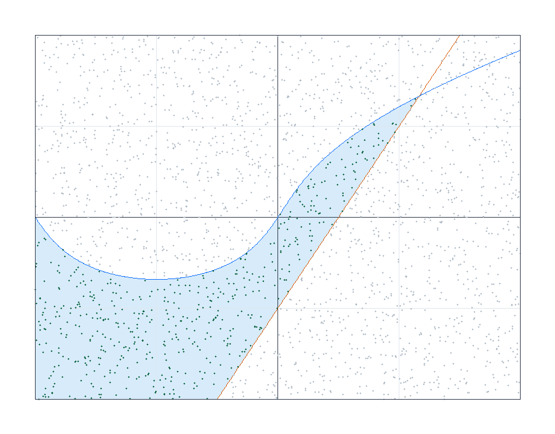

# Семестровое задание по дисциплине «Численные методы», вариант 17

## Исходные данные

| задача | данные варианта 17 |
|:---|:---|
| Интеграл | `∫₀¹ ∫₁² ∫₀³ (x² + y² + z) dx dy dz` |
| Система | `x₁ = 0,5x₁ + 0,1x₂ + 0,6`, `x₂ = 0,2x₁ + 0,4x₂ + 0,1` |
| Фигура | в таблице фигур есть варианты 1–12, поэтому использован вариант 5 по циклу `17 − 12 = 5` |

Во всех экспериментах используется фиксированное зерно генератора случайных чисел, поэтому результаты воспроизводимы.

## 1) Вычисление интеграла методом Монте-Карло

### Постановка задачи

Для варианта 17 задан интеграл:

`I = ∫₀¹ ∫₁² ∫₀³ (x² + y² + z) dx dy dz`.

Область интегрирования — прямоугольный параллелепипед:

`0 ≤ x ≤ 1`, `1 ≤ y ≤ 2`, `0 ≤ z ≤ 3`.

Его объем:

`V = (1−0)(2−1)(3−0) = 3`.

### Формула метода

Генерируем `N` случайных точек `Mᵢ(xᵢ, yᵢ, zᵢ)` равномерно внутри параллелепипеда. Затем считаем среднее значение функции `f(x,y,z)=x²+y²+z` в этих точках.

Формула Монте-Карло:

`I ≈ V/N · Σ f(xᵢ, yᵢ, zᵢ)`.

Для расчета взято:

`N = 200000`.

### Контрольное точное значение

Так как функция раскладывается по переменным, интеграл можно проверить аналитически:

`I = ∫₀¹∫₁²∫₀³x² dz dy dx + ∫₀¹∫₁²∫₀³y² dz dy dx + ∫₀¹∫₁²∫₀³z dz dy dx`.

Отдельные слагаемые:

`I₁ = (∫₀¹x²dx)·(2−1)·(3−0) = 1/3·3 = 1`.

`I₂ = (1−0)·(∫₁²y²dy)·(3−0) = 7/3·3 = 7`.

`I₃ = (1−0)·(2−1)·(∫₀³z dz) = 9/2 = 4,5`.

`I = I₁ + I₂ + I₃ = 1 + 7 + 4,5 = 12,5`.

### Результат расчета

| N | оценка Монте-Карло | точное значение | абс. ошибка | отн. ошибка | стандартная ошибка |
|---:|---:|---:|---:|---:|---:|
| 200000 | 12,497553269 | 12,500000000 | 0,002446731 | 0,0196% | 0,008468790 |

Полученная оценка отличается от точного значения меньше чем на одну стандартную ошибку, поэтому для выбранного `N` расчет можно считать устойчивым.

## 2) Решение системы линейных уравнений методом Монте-Карло

### Постановка задачи

Для варианта 17:

`x₁ = 0,5x₁ + 0,1x₂ + 0,6`

`x₂ = 0,2x₁ + 0,4x₂ + 0,1`

В матричном виде:

`x = αx + β`, где `α = [[0,5; 0,1], [0,2; 0,4]]`, `β = [0,6; 0,1]`.

### Идея метода

Так как суммы строк матрицы `α` меньше 1, решение можно представить рядом Неймана:

`x = β + αβ + α²β + ...`.

Метод Монте-Карло оценивает сумму этого ряда случайными траекториями. Для каждой стартовой компоненты моделируется цепочка состояний `1` и `2`. На каждом шаге выбирается следующее состояние, вес траектории умножается на отношение `αᵢⱼ / pᵢⱼ`, после чего к сумме добавляется вклад `Q·βⱼ`.

Для данной системы удобно взять вероятности переходов пропорционально коэффициентам строки:

`p₁₁ = 0,5 / 0,6 = 0,833333`, `p₁₂ = 0,1 / 0,6 = 0,166667`.

`p₂₁ = 0,2 / 0,6 = 0,333333`, `p₂₂ = 0,4 / 0,6 = 0,666667`.

Одна случайная траектория дает величину:

`θ = βᵢ₀ + Q₁βᵢ₁ + Q₂βᵢ₂ + ...`, где `Q₀=1`, `Qₖ₊₁=Qₖ·αᵢₖᵢₖ₊₁/pᵢₖᵢₖ₊₁`.

Среднее по большому числу траекторий является оценкой нужной компоненты решения.

### Точное решение для проверки

Перенесем неизвестные в левую часть:

`0,5x₁ − 0,1x₂ = 0,6`

`−0,2x₁ + 0,6x₂ = 0,1`

Определитель системы:

`D = 0,5·0,6 − (−0,1)·(−0,2) = 0,28`.

Тогда:

`x₁ = (0,6·0,6 − (−0,1)·0,1) / 0,28 = 1,321428571`.

`x₂ = (0,5·0,1 − (−0,2)·0,6) / 0,28 = 0,607142857`.

### Результат расчета

| компонент | Монте-Карло | точное решение | абс. ошибка | стандартная ошибка |
|:---|---:|---:|---:|---:|
| x1 | 1,321218400 | 1,321428571 | 0,000210171 | 0,000590629 |
| x2 | 0,607061035 | 0,607142857 | 0,000081822 | 0,000709075 |

Число траекторий для каждой компоненты: `120000`, длина траектории: `50`.

Обе оценки попали в интервал порядка одной стандартной ошибки от точного решения.

## 3) Определение площади фигуры методом Монте-Карло

### Постановка задачи

В таблице фигур приведены варианты 1–12, поэтому для номера 17 взят вариант 5 по циклу.

Ограничения варианта 5:

`−x² + y³ < 2x − y < 1`, `−2 < x < 2`, `−2 < y < 2`.

### Метод расчета

Ограничивающий прямоугольник:

`−2 < x < 2`, `−2 < y < 2`, `Sпрям = 16`.

Формула площади:

`S ≈ Sпрям · K/N`, где `K` — количество точек, попавших в фигуру.

Для каждой случайной точки проверяются два неравенства:

`−x² + y³ < 2x − y` и `2x − y < 1`.

Если оба условия выполнены, точка считается попавшей внутрь фигуры.

### Контрольное численное значение

Для проверки площадь дополнительно вычислена одномерным численным интегрированием по вертикальным сечениям. Из первого неравенства:

`y³ + y < x² + 2x`.

Так как функция `y³ + y` монотонно возрастает, верхняя граница сечения находится как корень уравнения:

`y³ + y = x² + 2x`.

Нижняя граница задается прямой `y = 2x − 1`. Далее высота сечения интегрируется по `x ∈ [−2; 2]` методом Симпсона.

### Результат расчета

| N | K | Sпрям | площадь Монте-Карло | контрольное численное значение | абс. ошибка | отн. ошибка |
|---:|---:|---:|---:|---:|---:|---:|
| 150000 | 32822 | 16,000000 | 3,501013333 | 3,496313405 | 0,004699928 | 0,1344% |

Построенная фигура:

## Вывод

Метод Монте-Карло дал приемлемые приближенные значения во всех трех задачах. При увеличении количества случайных точек и траекторий точность улучшается как величина порядка `1/√N`, поэтому для повышения точности нужно существенно увеличивать число испытаний.
