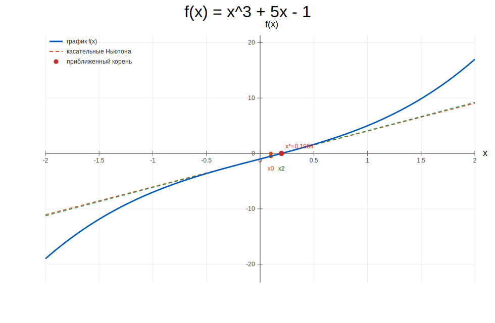

# Лабораторная работа №2, вариант 17

Уравнение: `x^3 + 5x - 1 = 0`

## Что сделано

1. Выполнена графическая изоляция корня через табулирование функции и поиск смены знака.
2. Для основной части использован один метод (метод Ньютона) при точности `eps=0.01`.
3. Для дополнительной части использованы два метода (секущих и Стеффенсена) при точности `eps=1e-6`.
4. Построен график с подписанными осями, делениями и касательными Ньютона.

## 1) Графическая изоляция корня

Интервалы смены знака функции при табулировании с шагом 0.1:

`[0.1; 0.2]`

График функции (с осями, делениями и касательными Ньютона):

Таблица значений в окрестности пересечения оси `Ox`:

| x | f(x) |
|---:|---:|
| 0.0000000000 | -1.0000000000 |
| 0.0500000000 | -0.7498750000 |
| 0.1000000000 | -0.4990000000 |
| 0.1500000000 | -0.2466250000 |
| 0.2000000000 | 0.0080000000 |
| 0.2500000000 | 0.2656250000 |
| 0.3000000000 | 0.5270000000 |

Так как `f'(x)=3x^2+5>0` для всех `x`, функция строго возрастает, значит действительный корень единственный.

## 2) Основное задание (один метод, eps = 0.01)

Выбранный метод: метод Ньютона.

Начальное приближение: `x0 = 0.1`

Приближенный корень:

`x ≈ 0.1984372832` (`|Δx| < 0.01`)

Итерации:

| n | x_n | f(x_n) | abs(x_n - x_(n-1)) |
|---:|---:|---:|---:|
| 1 | 0.1992047714 | 0.0039288084 | 0.0992047714 |
| 2 | 0.1984372832 | 0.0000003516 | 0.0007674881 |

## 3) Дополнительное задание (eps = 1e-06)

Выбраны два метода:

1. Метод секущих
2. Метод Стеффенсена

Метод секущих: `x0 = 0.1`, `x1 = 0.2`

Результат: `x ≈ 0.1984372145`

| n | x_n | f(x_n) | abs(x_n - x_(n-1)) |
|---:|---:|---:|---:|
| 1 | 0.1984220907 | -0.0000774055 | 0.0015779093 |
| 2 | 0.1984372118 | -0.0000000141 | 0.0000151211 |
| 3 | 0.1984372145 | 0.0000000000 | 0.0000000028 |

Метод Стеффенсена: `x0 = 0.1`

Результат: `x ≈ 0.1984372145`

| n | x_n | f(x_n) | abs(x_n - x_(n-1)) |
|---:|---:|---:|---:|
| 1 | 0.1972842109 | -0.0059004352 | 0.0972842109 |
| 2 | 0.1984381483 | 0.0000047792 | 0.0011539375 |
| 3 | 0.1984372145 | 0.0000000000 | 0.0000009338 |

## 4) Как работают использованные методы

### Метод Ньютона (касательных)

Итерационная формула:

`x_(n+1) = x_n - f(x_n)/f'(x_n)`

Идея: в точке `x_n` строится касательная к графику `y=f(x)`, а ее пересечение с осью `Ox` берется как следующее приближение.

Почему метод сошелся в этой задаче:

- `f'(x)=3x^2+5` не обращается в ноль;
- стартовое приближение близко к корню (`x0=0.1`, корень в `[0.1; 0.2]`);
- функция гладкая и монотонная.

### Метод секущих

Итерационная формула:

`x_(n+1) = x_n - f(x_n)*(x_n - x_(n-1)) / (f(x_n)-f(x_(n-1)))`

Идея: вместо производной используется наклон секущей через две последние точки графика.
Это удобно, когда не хочется считать производную явно.

### Метод Стеффенсена

Итерационная формула:

`x_(n+1) = x_n - f(x_n)^2 / ( f(x_n + f(x_n)) - f(x_n) )`

Идея: ускорение итерационного процесса без прямого вычисления производной. На практике часто дает быструю сходимость рядом с корнем.

## 5) Вывод

Все использованные методы сошлись к одному корню:

`x* ≈ 0.1984372145`

Основное требование (`eps=0.01`) выполнено методом Ньютона, дополнительное (`eps=1e-6`) выполнено методами секущих и Стеффенсена.
