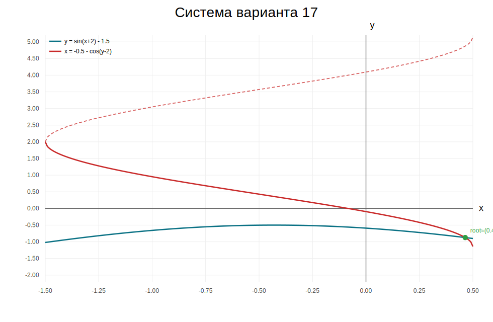

# Лабораторная работа №4, вариант 17

## Постановка задачи

Требуется решить систему нелинейных уравнений с точностью `eps = 0.001`:

```text
sin(x + 2) - y = 1.5
x + cos(y - 2) = -0.5
```

Использованные методы:
1. Метод Ньютона
2. Метод простых итераций (Якоби)
3. Метод Зейделя
4. Метод наискорейшего спуска (дополнительное задание)

Начальное приближение: `x0 = 0.5000`, `y0 = -0.8000`.

Графическая интерпретация системы (пересечение кривых):



## 1) Метод Ньютона

Итерационная схема:

```text
J(x_k, y_k) * [dx_k, dy_k]^T = -F(x_k, y_k)
x_(k+1) = x_k + dx_k
y_(k+1) = y_k + dy_k
```

| k | x_k | y_k | dx | dy | delta_inf | residual_inf |
|---:|---:|---:|---:|---:|---:|---:|
| 1 | 0.4675147982 | -0.8755025438 | -0.0324852018 | -0.0755025438 | 0.0755025438 | 0.0027083805 |
| 2 | 0.4642121281 | -0.8732425540 | -0.0033026701 | 0.0022599898 | 0.0033026701 | 0.0000034088 |
| 3 | 0.4642101624 | -0.8732444311 | -0.0000019657 | -0.0000018771 | 0.0000019657 | 0.0000000000 |

Итог: `x ≈ 0.4642101624`, `y ≈ -0.8732444311`, итераций: `3`.

## 2) Метод простых итераций (Якоби)

Выбрано преобразование системы:

```text
x = -0.5 - cos(y - 2)
y = sin(x + 2) - 1.5
```

Схема Якоби:

```text
x_(k+1) = -0.5 - cos(y_k - 2)
y_(k+1) = sin(x_k + 2) - 1.5
```

| k | x_k | y_k | delta_inf | residual_inf |
|---:|---:|---:|---:|---:|
| 1 | 0.4422223407 | -0.9015278559 | 0.1015278559 | 0.0452638042 |
| 2 | 0.4713225702 | -0.8562640517 | 0.0452638042 | 0.0225382867 |
| 3 | 0.4595692120 | -0.8788023384 | 0.0225382867 | 0.0091674471 |
| 4 | 0.4656688812 | -0.8696348913 | 0.0091674471 | 0.0047468632 |
| 5 | 0.4632468530 | -0.8743817545 | 0.0047468632 | 0.0018876585 |
| 6 | 0.4645110877 | -0.8724940960 | 0.0018876585 | 0.0009848493 |
| 7 | 0.4640109478 | -0.8734789453 | 0.0009848493 | 0.0003897329 |

Итог: `x ≈ 0.4640109478`, `y ≈ -0.8734789453`, итераций: `7`.

## 3) Метод Зейделя

Схема Зейделя:

```text
x_(k+1) = -0.5 - cos(y_k - 2)
y_(k+1) = sin(x_(k+1) + 2) - 1.5
```

| k | x_k | y_k | delta_inf | residual_inf |
|---:|---:|---:|---:|---:|
| 1 | 0.4422223407 | -0.8562640517 | 0.0577776593 | 0.0173468713 |
| 2 | 0.4595692120 | -0.8696348913 | 0.0173468713 | 0.0036776410 |
| 3 | 0.4632468530 | -0.8724940960 | 0.0036776410 | 0.0007640948 |
| 4 | 0.4640109478 | -0.8730892124 | 0.0007640948 | 0.0001580484 |

Итог: `x ≈ 0.4640109478`, `y ≈ -0.8730892124`, итераций: `4`.

## 4) Дополнительное задание: метод наискорейшего спуска

Функция минимизации:

```text
Phi(x, y) = f1(x, y)^2 + f2(x, y)^2
```

Градиентный шаг:

```text
[x_(k+1), y_(k+1)]^T = [x_k, y_k]^T - alpha_k * grad(Phi)(x_k, y_k)
```

Шаг `alpha_k` выбирается одномерной минимизацией `Phi(x_k - alpha*Phi_x', y_k - alpha*Phi_y')`.

| k | x_k | y_k | alpha_k | grad_inf | delta_inf | residual_inf | Phi(x_k,y_k) |
|---:|---:|---:|---:|---:|---:|---:|---:|
| 1 | 0.4444963763 | -0.8482289933 | 0.1994867688 | 0.2782321058 | 0.0555036237 | 0.0127802341 | 0.0002589226 |
| 2 | 0.4649131061 | -0.8717252810 | 1.9318751202 | 0.0121624257 | 0.0234962877 | 0.0020670499 | 0.0000054978 |
| 3 | 0.4637861969 | -0.8727044911 | 0.2072720012 | 0.0054368616 | 0.0011269092 | 0.0002806657 | 0.0000001227 |
| 4 | 0.4642258622 | -0.8732104758 | 1.8729889457 | 0.0002701482 | 0.0005059846 | 0.0000461890 | 0.0000000027 |

Итог: `x ≈ 0.4642258622`, `y ≈ -0.8732104758`, итераций: `4`.

## 5) Сводный результат

| Метод | x | y | iterations | residual_inf |
|---|---:|---:|---:|---:|
| Ньютон | 0.4642101624 | -0.8732444311 | 3 | 0.000000000002 |
| Простые итерации | 0.4640109478 | -0.8734789453 | 7 | 0.000389732898 |
| Зейдель | 0.4640109478 | -0.8730892124 | 4 | 0.000158048434 |
| Наискорейший спуск | 0.4642258622 | -0.8732104758 | 4 | 0.000046189027 |

Все методы сошлись к одному и тому же решению системы в пределах заданной точности.
