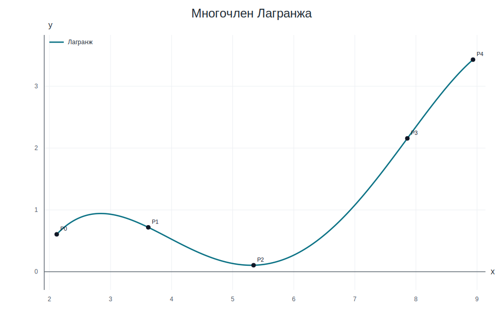
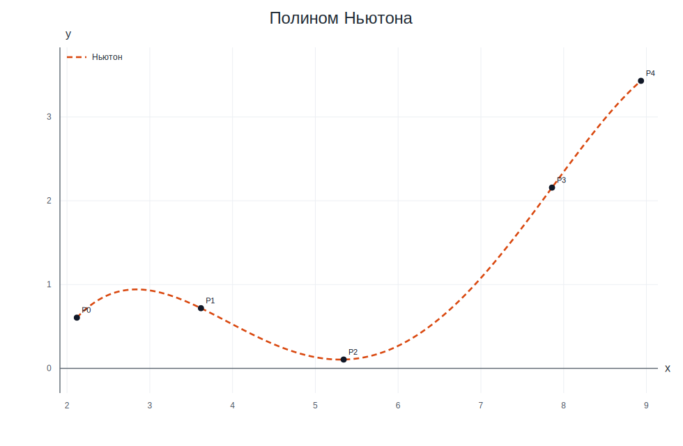
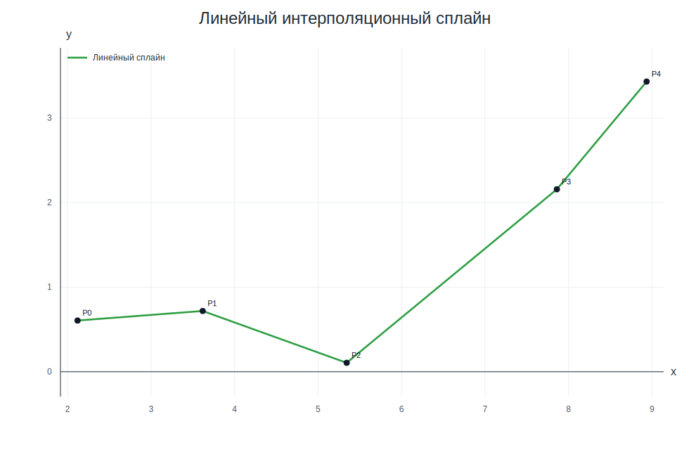
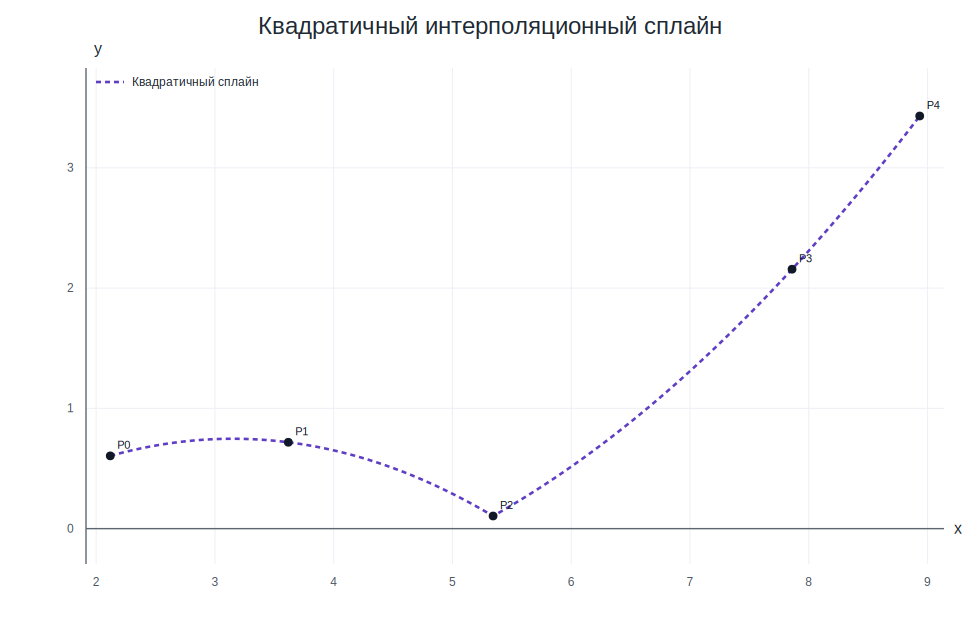
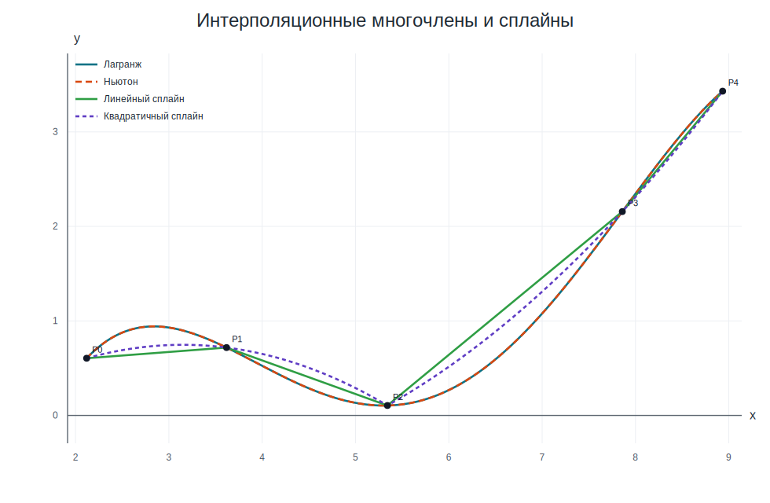

# Лабораторная работа №5, вариант 17

## Постановка задачи

Функция задана таблично в пяти узлах. Требуется:

1. Построить интерполяционный многочлен Лагранжа и вычислить `L₄(x₁ + x₂)`.
2. Построить таблицы конечных и разделенных разностей.
3. Построить полином Ньютона и вычислить `N₄(x₁ + x₂)`.
4. Построить линейный и квадратичный интерполяционные сплайны.
5. Построить графики многочленов и сплайнов.

Исходные узлы варианта 17:

| i | xᵢ | yᵢ |
|---:|---:|---:|
| 0 | 2,119 | 0,605 |
| 1 | 3,618 | 0,718 |
| 2 | 5,342 | 0,105 |
| 3 | 7,859 | 2,157 |
| 4 | 8,934 | 3,431 |

Точка вычисления: `x₁ + x₂ = 3,618 + 5,342 = 8,960`.
Значение немного выходит за последний узел `x₄ = 8,934`, поэтому вычисление является малой экстраполяцией.

## 1) Многочлен Лагранжа

Сначала строится сам интерполяционный многочлен `L₄(x)`, а затем в него подставляется `x = x₁ + x₂`.

Числа в знаменателях получаются как произведения разностей выбранного узла со всеми остальными узлами:

```text
D₀ = (2,119 − 3,618)·(2,119 − 5,342)·(2,119 − 7,859)·(2,119 − 8,934) = 188,990376814
D₁ = (3,618 − 2,119)·(3,618 − 5,342)·(3,618 − 7,859)·(3,618 − 8,934) = −58,262905567
D₂ = (5,342 − 2,119)·(5,342 − 3,618)·(5,342 − 7,859)·(5,342 − 8,934) = 50,236238145
D₃ = (7,859 − 2,119)·(7,859 − 3,618)·(7,859 − 5,342)·(7,859 − 8,934) = −65,867600788
D₄ = (8,934 − 2,119)·(8,934 − 3,618)·(8,934 − 5,342)·(8,934 − 7,859) = 139,892884356
```

Базисные многочлены Лагранжа имеют вид:

```text
p₀(x) = [(x − 3,618)·(x − 5,342)·(x − 7,859)·(x − 8,934)] / 188,990376814 = 0,005291275·(x − 3,618)·(x − 5,342)·(x − 7,859)·(x − 8,934)
p₁(x) = [(x − 2,119)·(x − 5,342)·(x − 7,859)·(x − 8,934)] / −58,262905567 = −0,017163579·(x − 2,119)·(x − 5,342)·(x − 7,859)·(x − 8,934)
p₂(x) = [(x − 2,119)·(x − 3,618)·(x − 7,859)·(x − 8,934)] / 50,236238145 = 0,019905949·(x − 2,119)·(x − 3,618)·(x − 7,859)·(x − 8,934)
p₃(x) = [(x − 2,119)·(x − 3,618)·(x − 5,342)·(x − 8,934)] / −65,867600788 = −0,015181971·(x − 2,119)·(x − 3,618)·(x − 5,342)·(x − 8,934)
p₄(x) = [(x − 2,119)·(x − 3,618)·(x − 5,342)·(x − 7,859)] / 139,892884356 = 0,007148326·(x − 2,119)·(x − 3,618)·(x − 5,342)·(x − 7,859)
```

Здесь `Dᵢ = ∏(xᵢ − xⱼ)`, `j ≠ i`. Например, `D₀ = (2,119 − 3,618)(2,119 − 5,342)(2,119 − 7,859)(2,119 − 8,934) = 188,990376814`.

Числовые коэффициенты:

| i | yᵢ | ∏(xᵢ − xⱼ), j ≠ i | 1 / ∏(xᵢ − xⱼ) | yᵢ / ∏(xᵢ − xⱼ) |
|---:|---:|---:|---:|---:|
| 0 | 0,605 | 188,990376814 | 0,005291275 | 0,003201221 |
| 1 | 0,718 | −58,262905567 | −0,017163579 | −0,012323450 |
| 2 | 0,105 | 50,236238145 | 0,019905949 | 0,002090125 |
| 3 | 2,157 | −65,867600788 | −0,015181971 | −0,032747511 |
| 4 | 3,431 | 139,892884356 | 0,007148326 | 0,024525908 |

Линейная комбинация базисных многочленов:

**L₄(x)** = 0,605·p₀(x) + 0,718·p₁(x) + 0,105·p₂(x) + 2,157·p₃(x) + 3,431·p₄(x)

После подстановки всех базисных множителей:

**L₄(x)** = 0,003201221·(x − 3,618)·(x − 5,342)·(x − 7,859)·(x − 8,934)
<br>− 0,012323450·(x − 2,119)·(x − 5,342)·(x − 7,859)·(x − 8,934)
<br>+ 0,002090125·(x − 2,119)·(x − 3,618)·(x − 7,859)·(x − 8,934)
<br>− 0,032747511·(x − 2,119)·(x − 3,618)·(x − 5,342)·(x − 8,934)
<br>+ 0,024525908·(x − 2,119)·(x − 3,618)·(x − 5,342)·(x − 7,859)

В степенной форме:

**L₄(x)** = −8,413236 + 8,795433·x − 2,837215·x² + 0,360266·x³ − 0,015254·x⁴

**L₄(x₁ + x₂) = L₄(8,960) = 3,452948719799**

График:



## 2) Таблицы разностей

Таблица конечных разностей:

| xₖ | yₖ | Δyₖ | Δ²yₖ | Δ³yₖ | Δ⁴yₖ |
| ---: | ---: | ---: | ---: | ---: | ---: |
| 2,119 | 0,605 | 0,113000 | −0,726000 | 3,391000 | −6,834000 |
| 3,618 | 0,718 | −0,613000 | 2,665000 | −3,443000 |  |
| 5,342 | 0,105 | 2,052000 | −0,778000 |  |  |
| 7,859 | 2,157 | 1,274000 |  |  |  |
| 8,934 | 3,431 |  |  |  |  |

Таблица разделенных разностей:

| xₖ | yₖ | 1-го порядка | 2-го порядка | 3-го порядка | 4-го порядка |
| ---: | ---: | ---: | ---: | ---: | ---: |
| 2,119 | 0,605 | 0,075383589 | −0,133711460 | 0,071390984 | −0,015253707 |
| 3,618 | 0,718 | −0,355568445 | 0,276072790 | −0,032563032 |  |
| 5,342 | 0,105 | 0,815256257 | 0,102967712 |  |  |
| 7,859 | 2,157 | 1,185116279 |  |  |  |
| 8,934 | 3,431 |  |  |  |  |

В этой таблице столбец `1-го порядка` соответствует разделенным разностям вида `f[xₖ; xₖ₊₁]`, столбец `2-го порядка` — `f[xₖ; xₖ₊₁; xₖ₊₂]` и так далее.

## 3) Полином Ньютона

Коэффициенты первой строки таблицы разделенных разностей:

`0,605000000, 0,075383589, −0,133711460, 0,071390984, −0,015253707`

Общая формула полинома Ньютона для пяти узлов:

**N₄(x)** = f[x₀] + f[x₀; x₁]·(x − x₀) + f[x₀; x₁; x₂]·(x − x₀)·(x − x₁)
<br>+ f[x₀; x₁; x₂; x₃]·(x − x₀)·(x − x₁)·(x − x₂)
<br>+ f[x₀; x₁; x₂; x₃; x₄]·(x − x₀)·(x − x₁)·(x − x₂)·(x − x₃)

После подстановки разделенных разностей:

**N₄(x)** = 0,605000000
<br>+ 0,075383589·(x − 2,119)
<br>− 0,133711460·(x − 2,119)·(x − 3,618)
<br>+ 0,071390984·(x − 2,119)·(x − 3,618)·(x − 5,342)
<br>− 0,015253707·(x − 2,119)·(x − 3,618)·(x − 5,342)·(x − 7,859)

В степенной форме:

**N₄(x)** = −8,413236 + 8,795433·x − 2,837215·x² + 0,360266·x³ − 0,015254·x⁴

**N₄(x₁ + x₂) = N₄(8,960) = 3,452948719799**

Контроль: `|L₄ − N₄| = 0,000000000000`.

График:



## 4) Интерполяционные сплайны

### Кусочно-линейная аппроксимация

На каждом интервале `[xᵢ; xᵢ₊₁]` линейное звено имеет вид `Sᵢ(x) = aᵢx + bᵢ`.

Общий вид кусочно-линейной функции:

```text
φ(x) = {
  a₁·x + b₁,  2,119 ≤ x ≤ 3,618,
  a₂·x + b₂,  3,618 ≤ x ≤ 5,342,
  a₃·x + b₃,  5,342 ≤ x ≤ 7,859,
  a₄·x + b₄,  7,859 ≤ x ≤ 8,934.
}
```

Для нахождения коэффициентов составляются системы:

```text
S₁:
  2,119·a₁ + b₁ = 0,605
  3,618·a₁ + b₁ = 0,718

S₂:
  3,618·a₂ + b₂ = 0,718
  5,342·a₂ + b₂ = 0,105

S₃:
  5,342·a₃ + b₃ = 0,105
  7,859·a₃ + b₃ = 2,157

S₄:
  7,859·a₄ + b₄ = 2,157
  8,934·a₄ + b₄ = 3,431
```

Решая эти системы, получаем:

| № | интервал | aᵢ | bᵢ | Sᵢ(x) = aᵢx + bᵢ |
|---:|:---|---:|---:|:---|
| 1 | [2,119; 3,618] | 0,075383589 | 0,445262175 | 0,075384·x + 0,445262 |
| 2 | [3,618; 5,342] | −0,355568445 | 2,004446636 | −0,355568·x + 2,004447 |
| 3 | [5,342; 7,859] | 0,815256257 | −4,250098927 | 0,815256·x − 4,250099 |
| 4 | [7,859; 8,934] | 1,185116279 | −7,156828837 | 1,185116·x − 7,156829 |

Тогда линейный сплайн имеет вид:

```text
φ(x) = {
  0,075384·x + 0,445262,  2,119 ≤ x ≤ 3,618,
  −0,355568·x + 2,004447,  3,618 ≤ x ≤ 5,342,
  0,815256·x − 4,250099,  5,342 ≤ x ≤ 7,859,
  1,185116·x − 7,156829,  7,859 ≤ x ≤ 8,934.
}
```

### Кусочно-квадратичная аппроксимация

Квадратичный сплайн строится двумя звеньями: по узлам `(x₀, x₁, x₂)` и `(x₂, x₃, x₄)`.
Каждое звено имеет вид `Qᵢ(x) = aᵢx² + bᵢx + cᵢ`.

Общий вид кусочно-квадратичной функции:

```text
φ(x) = {
  a₁·x² + b₁·x + c₁,  x ∈ [2,119; 5,342],
  a₂·x² + b₂·x + c₂,  x ∈ [5,342; 8,934].
}
```

Системы для коэффициентов:

```text
Q₁:
  4,490161·a₁ + 2,119·b₁ + c₁ = 0,605
  13,089924·a₁ + 3,618·b₁ + c₁ = 0,718
  28,536964·a₁ + 5,342·b₁ + c₁ = 0,105

Q₂:
  28,536964·a₂ + 5,342·b₂ + c₂ = 0,105
  61,763881·a₂ + 7,859·b₂ + c₂ = 2,157
  79,816356·a₂ + 8,934·b₂ + c₂ = 3,431
```

Решения систем:

| № | интервал | узлы | aᵢ | bᵢ | cᵢ | Qᵢ(x) = aᵢx² + bᵢx + cᵢ |
|---:|:---|:---|---:|---:|---:|:---|
| 1 | [2,119; 5,342] | x₀, x₁, x₂ | −0,133711460 | 0,842486233 | −0,579842347 | −0,133711·x² + 0,842486·x − 0,579842 |
| 2 | [5,342; 8,934] | x₂, x₃, x₄ | 0,102967712 | −0,544020509 | 0,072771668 | 0,102968·x² − 0,544021·x + 0,072772 |

Тогда квадратичный сплайн имеет вид:

```text
φ(x) = {
  −0,133711·x² + 0,842486·x − 0,579842,  x ∈ [2,119; 5,342],
  0,102968·x² − 0,544021·x + 0,072772,  x ∈ [5,342; 8,934].
}
```

Графики сплайнов:





## 5) Общий график и вывод

На одном чертеже показаны оба многочлена и оба сплайна:



| Метод | Значение в x₁ + x₂ |
|:---|---:|
| Лагранж | 3,452948719799 |
| Ньютон | 3,452948719799 |

Многочлены Лагранжа и Ньютона совпали с точностью вычислений, потому что являются разными формами одного интерполяционного полинома 4-й степени.
