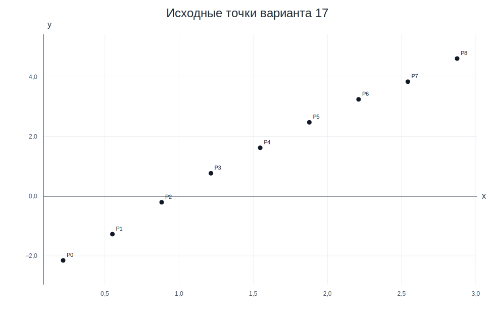
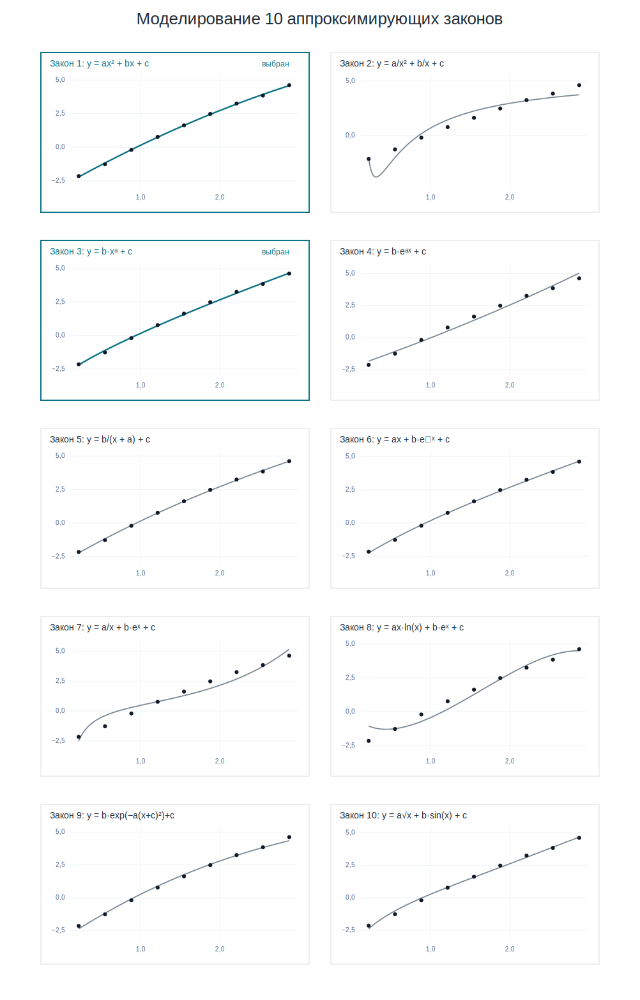
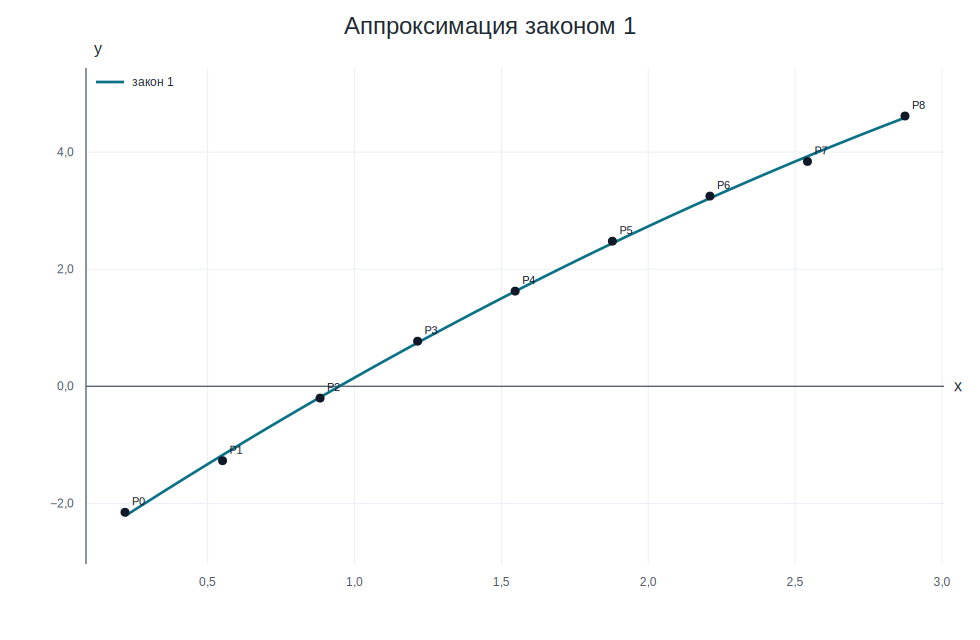
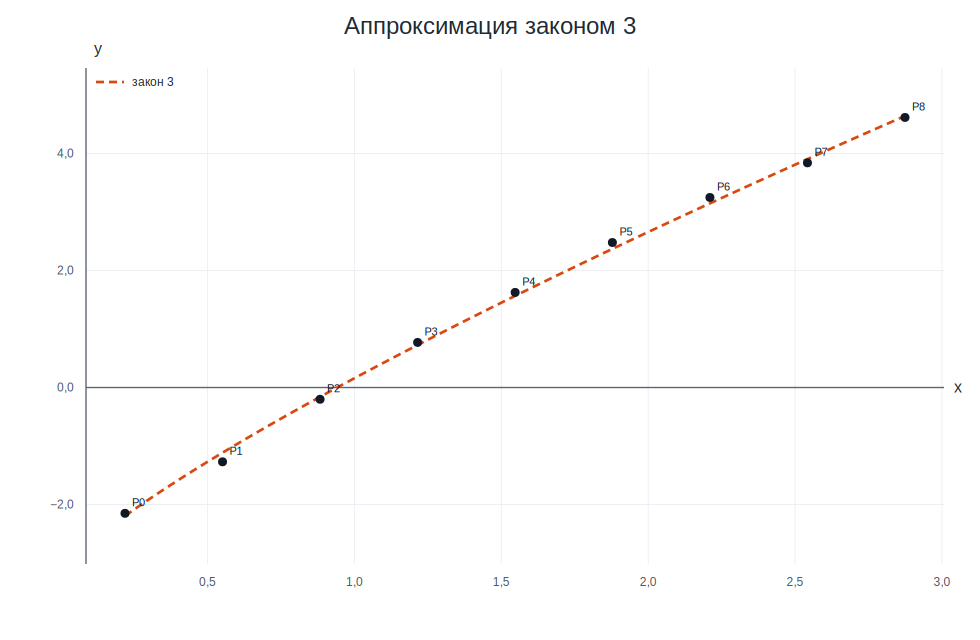
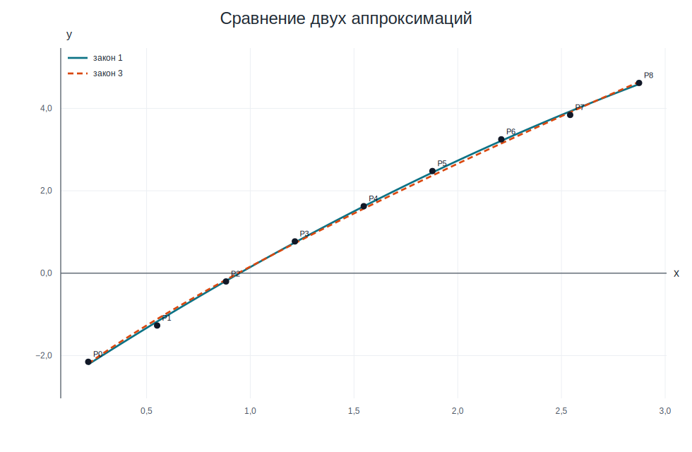

# Лабораторная работа №6, вариант 17

## Постановка задачи

Функция задана таблицей из 9 значений. Нужно выбрать два аппроксимирующих закона из предложенного списка и построить их по методу наименьших квадратов.

Исходные данные:

| i | xᵢ | yᵢ |
|---:|---:|---:|
| 0 | 0,219 | −2,151 |
| 1 | 0,551 | −1,270 |
| 2 | 0,883 | −0,201 |
| 3 | 1,215 | 0,771 |
| 4 | 1,547 | 1,626 |
| 5 | 1,878 | 2,479 |
| 6 | 2,210 | 3,249 |
| 7 | 2,542 | 3,841 |
| 8 | 2,874 | 4,617 |

График исходных точек:



## 1) Выбор аппроксимирующих законов

Для выбора законов были промоделированы графики всех 10 функций из задания. На каждом мини-графике черными точками показаны исходные данные, а линией — соответствующий аппроксимирующий закон с подобранными на компьютере коэффициентами.



По виду графиков наиболее естественно подходят:

1. `y = ax² + bx + c` — хорошо повторяет общий плавный изгиб точек.
2. `y = b·xᵃ + c` — визуально почти совпадает с точками и также хорошо описывает монотонный рост.

Именно эти два закона далее строятся подробно: для них составляются нормальные системы, находятся параметры и рассчитываются итоговые невязки.

## 2) Закон 1: квадратичная аппроксимация

Ищем функцию вида:

**y = ax² + bx + c**

Для МНК нормальная система имеет вид:

`a·Σxᵢ⁴ + b·Σxᵢ³ + c·Σxᵢ² = Σxᵢ²yᵢ`<br>
`a·Σxᵢ³ + b·Σxᵢ² + c·Σxᵢ = Σxᵢyᵢ`<br>
`a·Σxᵢ² + b·Σxᵢ + c·n = Σyᵢ`

После подстановки сумм:

`154,882367·a + 63,944198·b + 28,133309·c = 91,951142`<br>
`63,944198·a + 28,133309·b + 13,919000·c = 36,972797`<br>
`28,133309·a + 13,919000·b + 9,000000·c = 12,961000`

Решение системы:

`a = −0,246439705`
`b = 3,324415506`
`c = −2,930930562`

Полученный закон:

**y = −0,246440·x² + 3,324416·x − 2,930931**

Таблица ошибок:

| i | xᵢ | yᵢ | ŷᵢ | (ŷᵢ − yᵢ)² |
|---:|---:|---:|---:|---:|
| 0 | 0,219 | −2,151 | −2,214703 | 0,004058080 |
| 1 | 0,551 | −1,270 | −1,173997 | 0,009216584 |
| 2 | 0,883 | −0,201 | −0,187618 | 0,000179078 |
| 3 | 1,215 | 0,771 | 0,744434 | 0,000705762 |
| 4 | 1,547 | 1,626 | 1,622159 | 0,000014757 |
| 5 | 1,878 | 2,479 | 2,443158 | 0,001284684 |
| 6 | 2,210 | 3,249 | 3,212392 | 0,001340179 |
| 7 | 2,542 | 3,841 | 3,927298 | 0,007447421 |
| 8 | 2,874 | 4,617 | 4,587878 | 0,000848079 |
|  |  |  | **δ** | **0,025094624** |

Невязка: **δ = 0,025094624**.



## 3) Закон 3: степенная аппроксимация со сдвигом

Выбран закон:

**y = b·xᵃ + c**

Параметры `a` и `c` входят нелинейно, поэтому нормальную систему сразу для всех трех параметров составить нельзя.

Поэтому используется вложенный подбор:

1. Берем пробное значение `c` так, чтобы все `yᵢ − c > 0`.
2. Выполняем замену `tᵢ = ln(xᵢ)`, `zᵢ = ln(yᵢ − c)`.
3. Получаем линейную зависимость `z ≈ a·t + ln b`.
4. Для этого `c` находим лучшие `a` и `ln b` через нормальную систему МНК.
5. Считаем невязку `δ(c)` уже в исходных координатах.
6. Меняем `c` и повторяем расчет, пока невязка не станет минимальной.

В результате такого моделирования минимум невязки найден при:

`c = −3,175702802`

Ниже показан последний шаг этого процесса: для найденного `c` вводим замену

```text
tᵢ = ln(xᵢ)
zᵢ = ln(yᵢ − c)
z ≈ a·t + ln b
```

и составляем нормальную систему для окончательных `a` и `ln b`:

`a·Σtᵢ² + ln(b)·Σtᵢ = Σtᵢzᵢ`<br>
`a·Σtᵢ + ln(b)·n = Σzᵢ`

После подстановки сумм:

`5,916330·a + 1,803783·ln(b) = 6,947013`<br>
`1,803783·a + 9,000000·ln(b) = 12,295368`

Решение системы:

`a = 0,807006346`
`ln b = 1,204411464`
`b = e^(1,204411464) = 3,334795852`
`c = −3,175702802`

Полученный закон:

**y = 3,334796·x<sup>0,807006</sup> − 3,175703**

Таблица ошибок:

| i | xᵢ | yᵢ | ŷᵢ | (ŷᵢ − yᵢ)² |
|---:|---:|---:|---:|---:|
| 0 | 0,219 | −2,151 | −2,196656 | 0,002084467 |
| 1 | 0,551 | −1,270 | −1,114233 | 0,024263318 |
| 2 | 0,883 | −0,201 | −0,159509 | 0,001721477 |
| 3 | 1,215 | 0,771 | 0,726617 | 0,001969860 |
| 4 | 1,547 | 1,626 | 1,566598 | 0,003528545 |
| 5 | 1,878 | 2,479 | 2,369831 | 0,011917948 |
| 6 | 2,210 | 3,249 | 3,148358 | 0,010128911 |
| 7 | 2,542 | 3,841 | 3,904546 | 0,004038033 |
| 8 | 2,874 | 4,617 | 4,641853 | 0,000617663 |
|  |  |  | **δ** | **0,060270223** |

Невязка: **δ = 0,060270223**.



## 4) Сравнение

| закон | функция | невязка δ |
|---:|:---|---:|
| 1 | y = −0,246440·x² + 3,324416·x − 2,930931 | 0,025094624 |
| 3 | y = 3,334796·x<sup>0,807006</sup> − 3,175703 | 0,060270223 |

Лучший из двух выбранных законов по невязке — квадратичная аппроксимация, но степенной закон визуально также хорошо описывает исходные точки.

Общий график:


