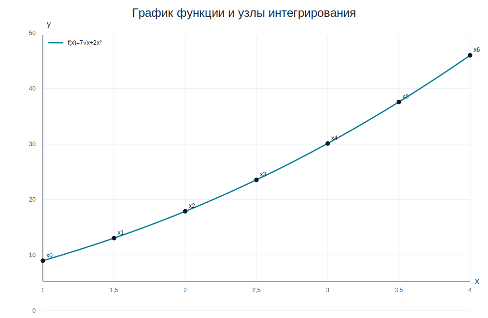
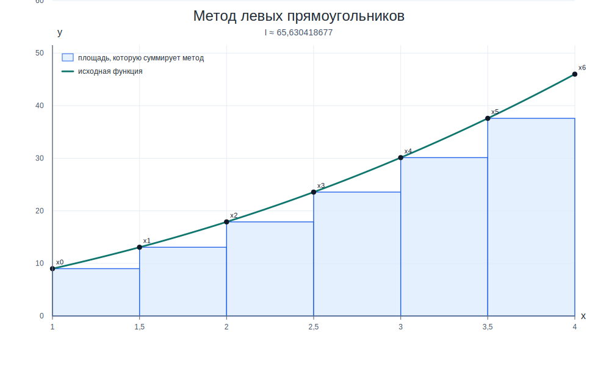
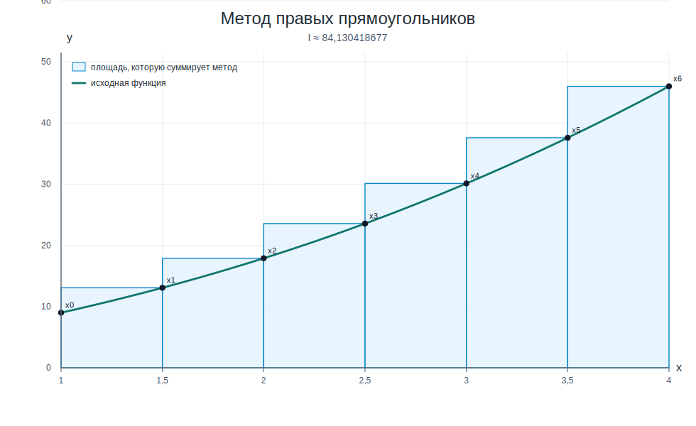
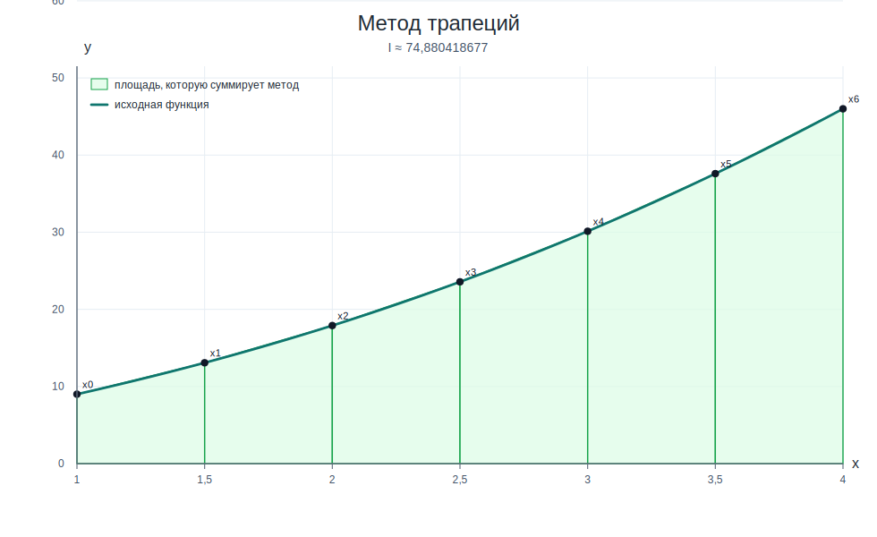
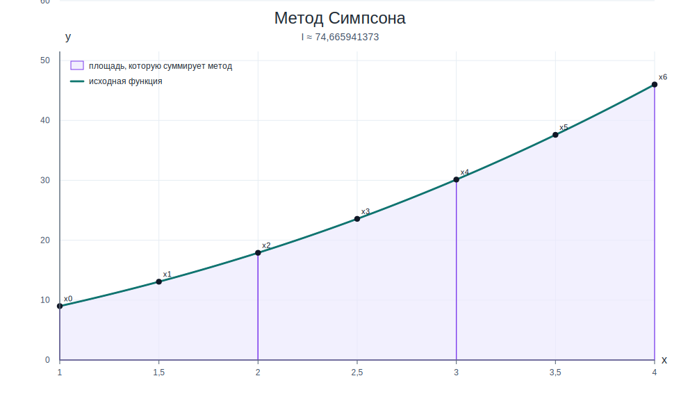
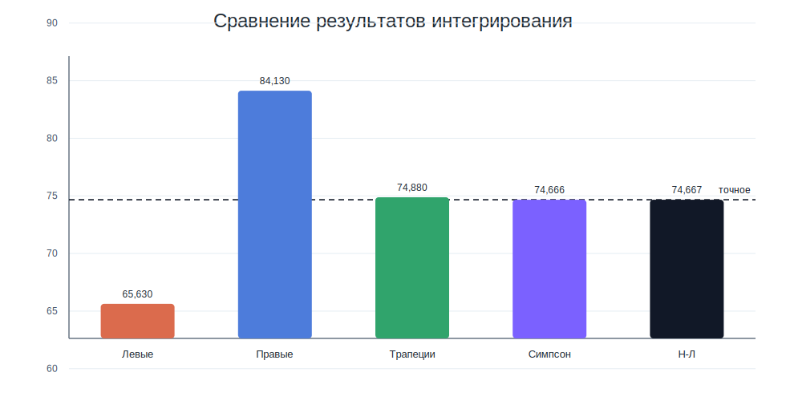

# Лабораторная работа №7, вариант 17

## Задание

Вычислить интеграл квадратурными формулами прямоугольников, трапеций и парабол Симпсона при заданном числе интервалов. Дополнительно вычислить точное значение по формуле Ньютона–Лейбница и сравнить результаты.

Для варианта 17:

`I = ∫₁⁴ (7√x + 2x²) dx`, `n = 6`.

Шаг разбиения:

`h = (b − a) / n = (4 − 1) / 6 = 0,500`

## 1) Значения функции в узлах

Узлы берутся по формуле `xᵢ = a + ih`. Для каждого узла вычисляем `f(xᵢ) = 7√xᵢ + 2xᵢ²`.

| i | xᵢ | f(xᵢ) | cᵢ лев. | cᵢ прав. | cᵢ трап. | cᵢ Симп. |
|---:|---:|---:|---:|---:|---:|---:|
| 0 | 1,000 | 9,000000 | 1 | 0 | 0,5 | 1/3 |
| 1 | 1,500 | 13,073214 | 1 | 1 | 1 | 4/3 |
| 2 | 2,000 | 17,899495 | 1 | 1 | 1 | 2/3 |
| 3 | 2,500 | 23,567972 | 1 | 1 | 1 | 4/3 |
| 4 | 3,000 | 30,124356 | 1 | 1 | 1 | 2/3 |
| 5 | 3,500 | 37,595801 | 1 | 1 | 1 | 4/3 |
| 6 | 4,000 | 46,000000 | 0 | 1 | 0,5 | 1/3 |

Удобно использовать общую квадратурную запись:

`I ≈ h·Σcᵢf(xᵢ)`

где `cᵢ` — коэффициенты выбранной формулы. Они уже внесены в таблицу выше.

## 2) Метод прямоугольников

Для прямоугольников считаем две стандартные формулы: по левым и по правым концам отрезков.

**Левые прямоугольники:**

`Iₗ = h·(f₀ + f₁ + ... + fₙ₋₁)`

`I = 0,500·131,260837354 = 65,630418677`

**Правые прямоугольники:**

`Iᵣ = h·(f₁ + f₂ + ... + fₙ)`

`I = 0,500·168,260837354 = 84,130418677`

На рисунках видно, что функция на каждом малом отрезке заменяется прямоугольником. У левых прямоугольников высота берется в левом конце отрезка, у правых — в правом.

## 3) Метод трапеций

`Iₜ = h·(0,5·f₀ + f₁ + ... + fₙ₋₁ + 0,5·fₙ)`

`I = 0,500·149,760837354 = 74,880418677`

Здесь на каждом отрезке кривая заменяется прямой между соседними узлами, поэтому площадь считается как сумма трапеций.

## 4) Метод парабол Симпсона

Так как `n = 6` — четное число, формулу Симпсона можно применять.

`Iₛ = h/3·(f₀ + 4f₁ + 2f₂ + 4f₃ + ... + fₙ)`

`I = 0,500·149,331882745 = 74,665941373`

В методе Симпсона каждые два соседних интервала объединяются, а функция на них заменяется параболой, проходящей через три узла.

## 5) Формула Ньютона–Лейбница

Найдем первообразную:

`F(x) = ∫(7√x + 2x²) dx = 14/3·x^(3/2) + 2/3·x³`

Тогда:

`I = F(4) − F(1)`

`F(4) = 14/3·4^(3/2) + 2/3·4³ = 80`

`F(1) = 14/3·1^(3/2) + 2/3·1³ = 16/3`

`I = 80 − 16/3 = 224/3 = 74,666666667`

## 6) Сравнение результатов

| способ | значение интеграла | абсолютная ошибка | относительная ошибка |
|:---|---:|---:|---:|
| Левые прямоугольники | 65,630418677 | 9,036247990 | 12,102118% |
| Правые прямоугольники | 84,130418677 | 9,463752010 | 12,674668% |
| Трапеции | 74,880418677 | 0,213752010 | 0,286275% |
| Параболы Симпсона | 74,665941373 | 0,000725294 | 0,000971% |
| Ньютон–Лейбниц | 74,666666667 | 0,000000000 | 0,000000% |

Наиболее точный результат при данном числе интервалов дал метод **Параболы Симпсона**: его абсолютная ошибка равна `0,000725294`.
