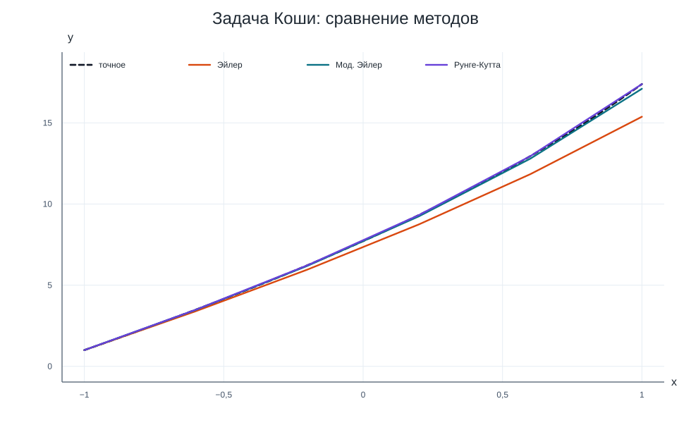
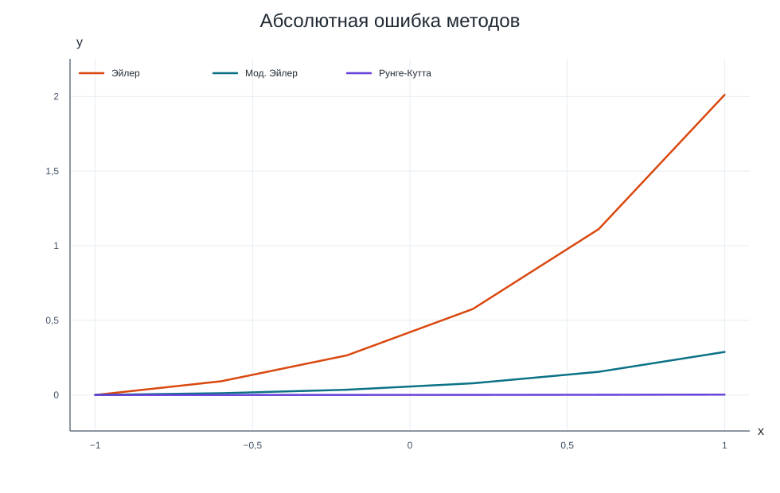
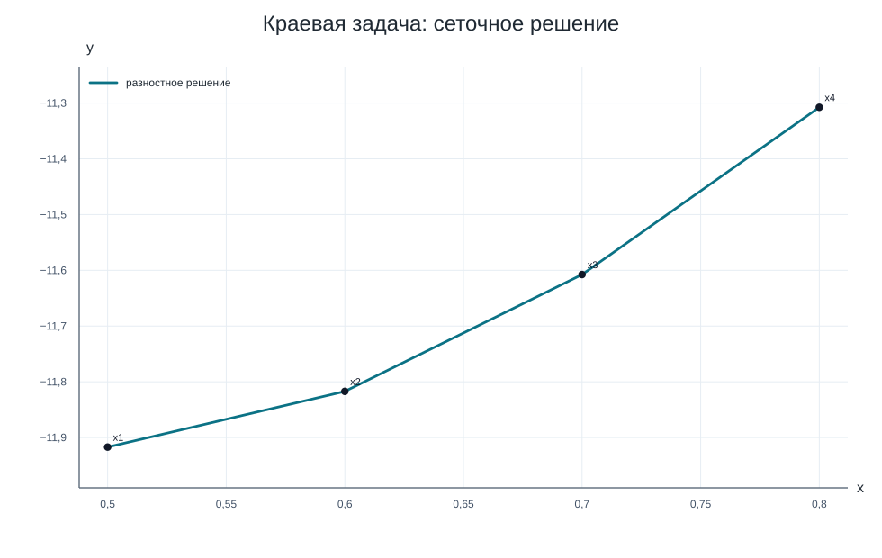

# Лабораторная работа №8, вариант 17

## Задание

В работе решаются две задачи из блока численного решения обыкновенных дифференциальных уравнений.

**№ 7.1. Задача Коши:**

`y' = y − 5x`, `y(−1) = 1`, `x ∈ [−1; 1]`, `h = 0,4`.

Нужно найти сеточное решение методом Эйлера, модифицированным методом Эйлера и методом Рунге-Кутта 4-го порядка.

**№ 7.2. Краевая задача:**

`y'' + 2xy' + y = 1`, `y'(0,5) = 1`, `y'(0,8) = 3`, `h = 0,1`.

Нужно построить конечно-разностную схему и решить полученную трехдиагональную систему методом прогонки.

## 1) Задача Коши

Правая часть уравнения:

`f(x, y) = y − 5x`

Для контроля точности удобно выписать аналитическое решение:

`y' − y = −5x`

`y = C·eˣ + 5x + 5`

Из условия `y(−1)=1` получаем `C=e`, поэтому:

`y(x) = eˣ⁺¹ + 5x + 5`

Сетка:

`xᵢ = −1 + i·0,4`, `i = 0, ..., 5`.

Первые шаги трех методов:

**Метод Эйлера:**

`yᵢ₊₁ = yᵢ + h·f(xᵢ, yᵢ)`

`f(x₀, y₀) = 6,000000000`
`y₁ = 1,000000000 + 0,400·6,000000000 = 3,400000000`

**Модифицированный метод Эйлера:**

`ỹᵢ₊₁ = yᵢ + h·f(xᵢ, yᵢ)`
`yᵢ₊₁ = yᵢ + h·(f(xᵢ, yᵢ) + f(xᵢ₊₁, ỹᵢ₊₁)) / 2`

`ỹ₁ = 3,400000000`
`f(x₁, ỹ₁) = 6,400000000`
`y₁ = 3,480000000`

**Метод Рунге-Кутта 4-го порядка:**

`yᵢ₊₁ = yᵢ + (k₀ + 2k₁ + 2k₂ + k₃) / 6`

`k₀ = 2,400000000`
`k₁ = 2,480000000`
`k₂ = 2,496000000`
`k₃ = 2,598400000`
`y₁ = 3,491733333`

Итоговая таблица значений:

| i | xᵢ | точное y(xᵢ) | Эйлер | ошибка | мод. Эйлер | ошибка | Рунге-Кутта | ошибка |
|---:|---:|---:|---:|---:|---:|---:|---:|---:|
| 0 | −1,000 | 1,000000000 | 1,000000000 | 0,000000000 | 1,000000000 | 0,000000000 | 1,000000000 | 0,000000000 |
| 1 | −0,600 | 3,491824698 | 3,400000000 | 0,091824698 | 3,480000000 | 0,011824698 | 3,491733333 | 0,000091364 |
| 2 | −0,200 | 6,225540928 | 5,960000000 | 0,265540928 | 6,190400000 | 0,035140928 | 6,225268338 | 0,000272591 |
| 3 | 0,200 | 9,320116923 | 8,744000000 | 0,576116923 | 9,241792000 | 0,078324923 | 9,319506955 | 0,000609968 |
| 4 | 0,600 | 12,953032424 | 11,841600000 | 1,111432424 | 12,797852160 | 0,155180264 | 12,951819175 | 0,001213249 |
| 5 | 1,000 | 17,389056099 | 15,378240000 | 2,010816099 | 17,100821197 | 0,288234902 | 17,386793724 | 0,002262375 |

Оценка точности по правилу Рунге выполнялась сравнением расчетов с шагами `h` и `h/2`:

`Δₕ/₂ = max|yᵢ^(h/2) − yᵢ^(h)| / (2ᵖ − 1)`

| метод | порядок p | max точная ошибка при h | оценка Δ для h/2 |
|:---|---:|---:|---:|
| Метод Эйлера | 1 | 2,010816099 | 0,813496422 |
| Модифицированный метод Эйлера | 2 | 0,288234902 | 0,067936740 |
| Метод Рунге-Кутта 4-го порядка | 4 | 0,002262375 | 0,000139701 |

График решений:

График абсолютных ошибок:

На этой сетке наименьшую максимальную ошибку дал **Метод Рунге-Кутта 4-го порядка**: `0,002262375`.

## 2) Краевая задача

**1. Определение сетки.**

Отрезок `[0,5; 0,8]` делится с шагом `h = 0,1`:

`x₁=0,5`, `x₂=0,6`, `x₃=0,7`, `x₄=0,8`.

Здесь `x₁` и `x₄` — краевые точки, `x₂` и `x₃` — внутренние точки.

**2. Определение сеточной функции.**

В каждом узле вводим значение функции:

| узел | x₁ | x₂ | x₃ | x₄ |
|:---|---:|---:|---:|---:|
| x | 0,5 | 0,6 | 0,7 | 0,8 |
| y | y₁ = y(x₁) | y₂ = y(x₂) | y₃ = y(x₃) | y₄ = y(x₄) |

**3. Аппроксимация уравнения.**

Исходная задача:

`y'' + 2xy' + y = 1`

`y'(0,5)=1`, `y'(0,8)=3`.

Для внутренних узлов используются центральные разности:

`y'ₖ ≈ (yₖ₊₁ − yₖ₋₁)/(2h)`

`y''ₖ ≈ (yₖ₋₁ − 2yₖ + yₖ₊₁)/h²`

Для краевых условий используются односторонние разности.

При `x₁ = 0,5`:

`(y₂ − y₁) / 0,1 = 1`

При `x₂ = 0,6`:

`(y₁ − 2y₂ + y₃) / 0,1² + 2·0,6·(y₃ − y₁) / (2·0,1) + y₂ = 1`

При `x₃ = 0,7`:

`(y₂ − 2y₃ + y₄) / 0,1² + 2·0,7·(y₄ − y₂) / (2·0,1) + y₃ = 1`

При `x₄ = 0,8`:

`(y₄ − y₃) / 0,1 = 3`

После приведения подобных членов получаем систему:

`−10y₁ + 10y₂ = 1`

`94y₁ − 199y₂ + 106y₃ = 1`

`93y₂ − 199y₃ + 107y₄ = 1`

`−10y₃ + 10y₄ = 3`

**4. Решение системы методом прогонки.**

Коэффициенты системы `aₖyₖ₋₁ + bₖyₖ + cₖyₖ₊₁ = dₖ` и прогоночные коэффициенты:

| k | xₖ | aₖ | bₖ | cₖ | dₖ | Uₖ | Vₖ |
|---:|---:|---:|---:|---:|---:|---:|---:|
| 1 | 0,500 | 0,000000 | −10,000000 | 10,000000 | 1,000000 | 1,000000000 | −0,100000000 |
| 2 | 0,600 | 94,000000 | −199,000000 | 106,000000 | 1,000000 | 1,009523810 | −0,099047619 |
| 3 | 0,700 | 93,000000 | −199,000000 | 107,000000 | 1,000000 | 1,017939658 | −0,097145964 |
| 4 | 0,800 | −10,000000 | 10,000000 | 0,000000 | 3,000000 | 0,000000000 | −11,307575758 |

Обратный ход прогонки:

`y₄ = V₄ = −11,307575758`

`y₃ = U₃·y₄ + V₃ = 1,017939658·(−11,307575758) − 0,097145964 = −11,607575758`

`y₂ = U₂·y₃ + V₂ = 1,009523810·(−11,607575758) − 0,099047619 = −11,817171717`

`y₁ = U₁·y₂ + V₁ = 1,000000000·(−11,817171717) − 0,100000000 = −11,917171717`

Сеточную функцию `yₖ = y(xₖ)` записываем в виде таблицы:

| k | xₖ | yₖ | невязка строки |
|---:|---:|---:|---:|
| 1 | 0,500 | −11,917171717 | 0,000000000000 |
| 2 | 0,600 | −11,817171717 | 0,000000000000 |
| 3 | 0,700 | −11,607575758 | 0,000000000000 |
| 4 | 0,800 | −11,307575758 | 0,000000000000 |

Проверка граничных производных:

`(y₂ − y₁)/h = 1,000000000`

`(y₄ − y₃)/h = 3,000000000`

Максимальная невязка строк системы: `0,000000000000`.

График сеточного решения:

